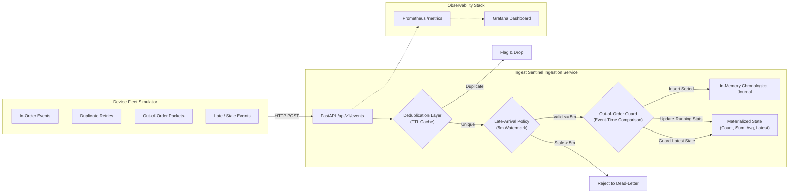

# Ingest Sentinel

> **Note:** This is an exploratory, personal learning project examining telemetry ingestion correctness under chaotic network delivery (out-of-order, duplicate, and late-arriving events). It is not designed or intended as a production ingestion pipeline.

## Overview
When high-volume telemetry from thousands of IoT devices traverses lossy networks, events inevitably arrive duplicated, temporally shuffled, or significantly delayed. **Ingest Sentinel** explores the central question: *When data arrives out of order, duplicated, and late simultaneously, how do you guarantee that the final stored state reflects physical reality rather than arrival sequence?*


## Verification Proof

During a simultaneous disorder burst (mixed duplicates, out-of-order timestamps, and stale packets), Prometheus counters and Grafana dashboards reflect real-time isolation and correction across active devices:


## Key Correctness Mechanisms
1. **Idempotent Deduplication (TTL Cache)**: Rejects retransmitted `event_ids` within a sliding retention window to prevent counter inflation.

2. **Event-Time Ordering vs. Arrival-Time Guard**: Isolates physical `latest_reading` state from historical aggregates. An older event arriving late is sorted into history and included in historical statistics without regressing the device's latest physical reading.

3. **5-Minute Watermark (Late-Arrival Window)**: Binds state mutability by accepting and reconciling events up to 5 minutes old while deterministically rejecting stale payloads.

4. **Bounded Metric Cardinality**: Global Prometheus operational metrics (`telemetry_events_ingested_total`, `telemetry_events_disorder_total`) without per-device label explosion.

## Setup & Quickstart
### Prerequisites
- Python 3.10+

- Virtualenv

### Installation
```bash
git clone https://github.com/aashiruu/ingest-sentinel.git
cd ingest-sentinel
python3 -m venv .venv
source .venv/bin/activate
pip install -r requirements.txt
```
### Run the Ingestion Service
```bash
uvicorn app.main:app --reload --port 8000
```
### Run the Simulated Device Fleet
```bash
# Clean sequential burst
python simulate_fleet.py --count 10 --mode normal

# Chaotic burst with duplicates, out-of-order, and delayed events
python simulate_fleet.py --count 10 --mode disorder
```
### Run Test Suite
```bash 
pytest -v
```
## Verification & Disorder Proof
- (docs/disorder-testing.md): The core chaos test scenario proving that mixed out-of-order, duplicate, and late events produce mathematically exact ground-truth state.

- (docs/tradeoffs.md): Detailed architectural trade-offs across storage, deduplication, ordering, watermarks, and cardinality.

- (docs/verification.md): Baseline endpoint curl tests and individual component test runs.
